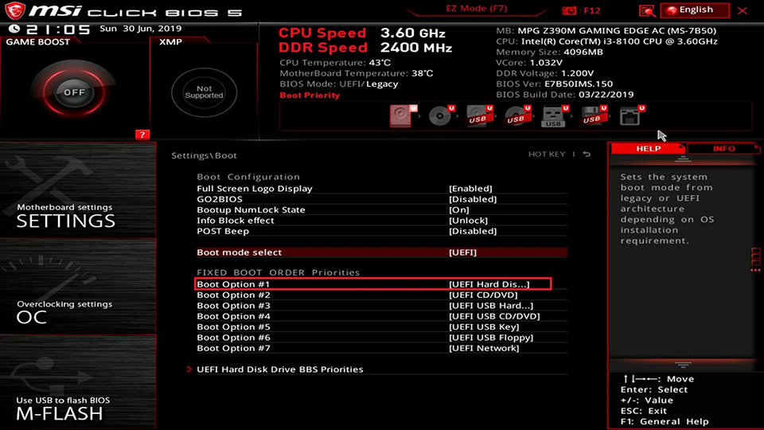

# System Firmwares: BIOS vs UEFI

## What is Firmware?
*Firmware* is the lowest level software that provides control over hardware components. The firmware my provide basic functions and abstractions to allow an operating system to interact with and control hardware components. For modern computers, the component known as the *motherboard* has firmware that facilitates control of the entire system and its components. Firmware is essentially an intermediary between hardware and software. The firmware is often stored in non-volatile, read-only or flash memory. Firmware can sometimes be updated on devices, like motherboards, to allow for new and upgraded features or expanded hardware support.

# Types of PC Firmwares
On modern day PCs there are two types of firmwares: the legacy BIOS or *Basic Input/Output System* and the more modern and used by default UEFI or *Unified Extensible Firmware Interface*. It is highly recommended you utilize the UEFI for this book unless you are on older hardware that does not support the UEFI. If your hardware supports both, ensure it is in UEFI mode. The UEFI and BIOS are contrasted below to illustrate the UEFI's advantages over its predecessor.

|Type   |Age   |Boot Speeds   |# of Partitions   |Drive Capacity   |Secure Boot   |UI   | Partition Table  |
|---|---|---|---|---|---|---|---|
|UEFI   |2002   |Faster Boots   | Unlimited  |9.4 Zettabytes  |Yes   |User Friendly & Verbose   | GPT  |
|BIOS   |1975   |Slower Boots   |  4 partitions per drive  |2.2 Terabytes   |No   |Dated & Less Functional |MBR   |

As you can gleam from the about table, the UEFI and BIOS only support a single, respective *partition table*. You will come to understand partition tables in the following chapter: [Partition Tables](./part.md).

# Selecting Boot Devices

*Boot devices* can be selected from within your UEFI or BIOS. The boot device is the storage device that contains the operating system components that your computer can boot from. For instance, if you wanted to boot from your live Linux USB, you would need the USB to be your boot device. In may UEFI/BIOS interfaces multiple boot device may be selected that boot in order of presence, you may force a boot from a particular device, etc. To access your system's firmware interface, a common convention is to either press `F2` or `Delete` or some combination thereof while your system boots. Consult your device's manual for more information. 

*A UEFI interface where ordered boot devices may be selected.*

Once you are in the firmware interface for your device navigate to select the device that your Linux image has been written to and save and exit. Reboot your computer and you should be met with a Linux Live environment.

